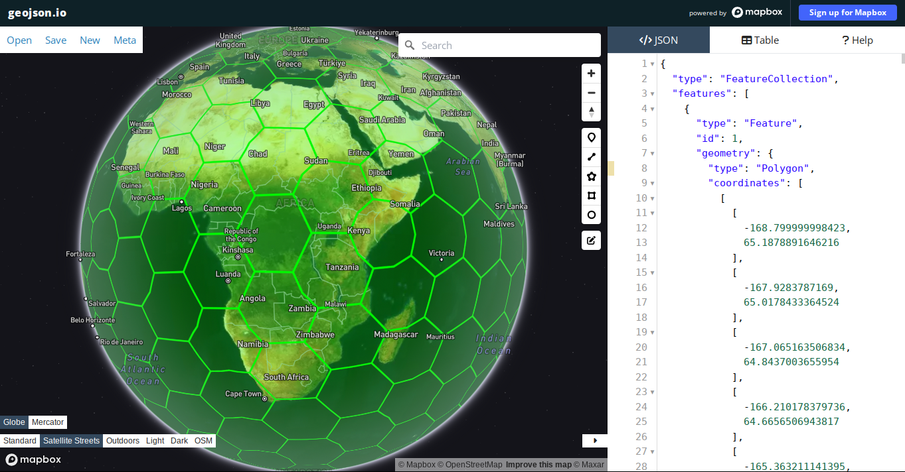
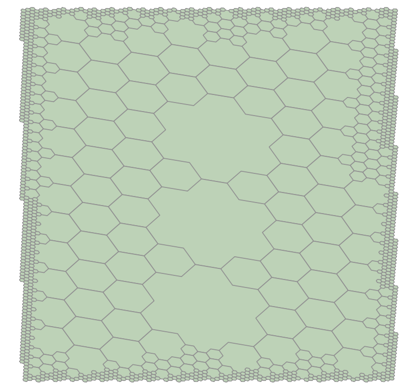
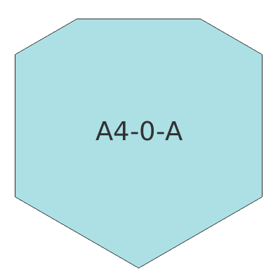
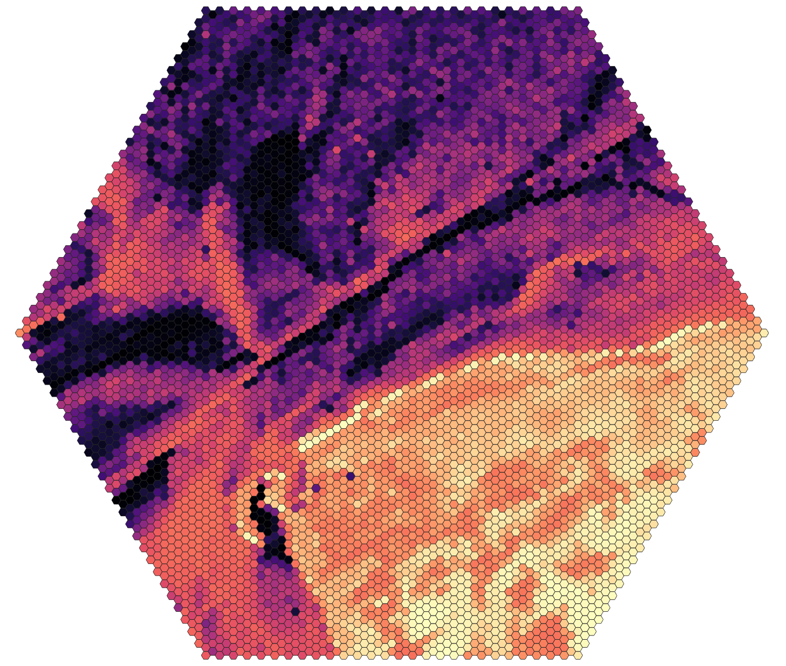

[](https://dggal.org/docs/html/dggal/Classes/DGGRS.html)<br>

# DGGAL, the Discrete Global Grid Abstraction Library

DGGAL provides a common interface to perform various operations on Discrete Global Grid Reference Systems (DGGRS), facilitating the implementation of Discrete Global Grid Systems (DGGS),
including implementing Web APIs based on the [OGC API - DGGS Standard](https://docs.ogc.org/DRAFTS/21-038r1.html).

## Supported Discrete Global Grid Reference Systems

DGGAL currently supports all three DGGRS described in [OGC API - DGGS Annex B](https://docs.ogc.org/DRAFTS/21-038r1.html#annex-dggrs-def), as well as additional DGGRSs:

* [GNOSIS Global Grid](https://docs.ogc.org/DRAFTS/21-038r1.html#ggg-dggrs): An axis-aligned quad-tree defined in WGS84 latitude and longitude, with special handling of polar regions, corresponding to the [OGC 2D Tile Matrix Set of the same name](https://docs.ogc.org/is/17-083r4/17-083r4.html#toc58)
* [ISEA3H](https://docs.ogc.org/DRAFTS/21-038r1.html#isea3h-dggrs): An equal area hexagonal grid with a refinement ratio of 3 defined in the Icosahedral Snyder Equal Area (ISEA) projection
* [ISEA9R](https://docs.ogc.org/DRAFTS/21-038r1.html#isea9r-dggrs): An equal area rhombic grid with a refinement ratio of 9 defined in the ISEA projection transformed into a 5x6 Cartesian space resulting in axis-aligned square zones
* **IVEA3H**: An equal area hexagonal grid with a refinement ratio of 3 defined in the Icosahedral Vertex-oriented Great Circle Equal Area (tentatively called IVEA) projection based on [Slice & Dice (2006)](https://www.tandfonline.com/doi/abs/10.1559/152304006779500687), using the same global indexing and sub-zone ordering as for ISEA3H
* **IVEA9R**: An equal area rhombic grid with a refinement ratio of 9 defined in the IVEA projection transformed into a 5x6 Cartesian space resulting in axis-aligned square zones, using the same global indexing and sub-zone ordering as for ISEA9R

## libDGGAL API Documentation

The `DGGRS` class provides most of the functionality of the library, allowing to resolve DGGRS zones by textual ID to a unique 64-bit zone integer identifier (`DGGRSZone`).
The geometry and sub-zones of a particular zone can also be queried.
The concept of [sub-zones](https://docs.ogc.org/DRAFTS/21-038r1.html#term-sub-zone) is key to encoding both vector and raster geospatial data quantized to a DGGRS.
The DGGAL library also allows to resolve a sub-zone index at a particular depth from a parent zone, allowing to read DGGS-optimized data such as
[DGGS-JSON](http://dggs-json.org) and [DGGS-JSON-FG](https://docs.ogc.org/DRAFTS/21-038r1.html#rc_data-dggs-jsonfg).

A very early draft of the API documentation can be [found here](https://dggal.org/docs/html/dggal/Classes/DGGRS.html).

While the library is written in the [eC programming language](https://ec-lang.org), object-oriented bindings for C, C++ and Python generated using the
Ecere SDK's [`bgen` tool](https://github.com/ecere/bgen) are provided. Partial bindings for rust are available as well.
Support for additional languages may be added in the future.

## Building DGGAL

The recommended method to obtain and build DGGAL and the `dgg` tool is to follow the instructions in [BUILDING.md](BUILDING.md),
or running [fetchAndBuild.sh](fetchAndBuild.sh) / [fetchAndBuild.bat](fetchAndBuild.sh).

This method will use this `eC-core` branch meant to be used with the [stand-alone eC development kit and eC runtime library](https://github.com/ecere/eC),
avoiding unnecessary dependencies on other components of the Ecere SDK runtime library.

The script will clone both the eC and DGGAL repositories and build everything, including the C, C++, rust and Python bindings
if the required development tools are properly installed and configured.

## Language bindings

### C Bindings

C bindings are [available here](https://github.com/ecere/dggal/tree/eC-core/bindings/c).

A C example implementing the `dgg info` command using the DGGAL C bindings is [available here](https://github.com/ecere/dggal/blob/eC-core/bindings_examples/c/info.c).

### C++ Bindings

C++ bindings (depending on the C bindings) are [available here](https://github.com/ecere/dggal/tree/eC-core/bindings/cpp).

A C++ example implementing the `dgg info` command using the DGGAL C++ bindings is [available here](https://github.com/ecere/dggal/blob/eC-core/bindings_examples/cpp/info.cpp).

### Python Bindings

Python bindings (depending on the C bindings) are [available here](https://github.com/ecere/dggal/tree/eC-core/bindings/py).

A Python example using the DGGAL Python bindings is [available here](https://github.com/ecere/dggal/blob/eC-core/bindings_examples/py/info.py).

### rust Bindings

rust bindings (depending on the C bindings) are [available here](https://github.com/ecere/dggal/tree/eC-core/bindings/rust).

A rust example using the DGGAL rust bindings is [available here](https://github.com/ecere/dggal/blob/eC-core/bindings_examples/rust/info.rs).

## (Older) Pre-built binaries

These older pre-built binaries for Linux and Windows include the `dgg` utility (as both statically and dynamically linked binaries) as well as the DGGAL library (also as both a static and dynamic library).

The [Ecere SDK](https://ecere.org) should be installed to use the dynamically linked version.

### Version 0.0.1 - build #42

* [Linux 64-bit](https://dggal.org/binaries/dggal-v0.0.1-b42-linux-x86_64.tar.gz)
* [Windows 64-bit](https://dggal.org/binaries/dggal-v0.0.1-b42-windows-x86_64.tar.gz)

### Ecere SDK binaries (build 275)

The following recent pre-built binaries from the [Ecere SDK](https://ecere.org) can be installed to use the dynamically linked version:

* [Linux 64-bit](https://dggal.org/binaries/ecere-sdk-b275-binaries-linux-x86_64.tar.gz)
* [Windows 64-bit](https://dggal.org/binaries/ecere-sdk-b275-binaries-windows-x86_64.tar.gz)

The dynamic libraries are needed to build eC applications making use of the library, re-generate the bindings, generate the documentation, or to use the binaries or bindings built with a dependency on them.

[cURL](https://curl.se/download.html) and/or OpenSSL ([for Windows](https://slproweb.com/products/Win32OpenSSL.html)) dynamic libraries may also be required to be installed,
as these are currently dependencies of <em>libecere</em> which includes HTTPS support.

A future version of the Ecere SDK will be better modularized, based on the stand-alone eC runtime, so as to avoid these dependencies from the dynamic DGGAL library.

See also [**Building DGGAL**](#building-dggal) section for building a version of DGGAL without these dependencies.

## `dgg` tool

### Syntax
```
   dgg <dggrs> <command> [options] <arguments>
```

### Supported DGGRSs
* `gnosis` (Global Grid)
* `isea3h`
* `isea9r`
* `ivea3h`
* `ivea9r`

### Commands

[**info**](#info) [_zone_]

- Display information about a DGGRS or about a zone of a DGGRS

[**zone**](#zone) <_coord1,coord2_> [_level_]

- Return DGGRS zone at position -- specified in EPSG:4326 (lat,lon)

[**level**](#level) [_level_]

- Display information about a DGGRS refinement level

[**grid**](#grid) [_level_]
- Generate DGGRS grid at specified refinement level (default: 0)

[**geom**](#geom) <_zone_>
- Generate geometry for a particular zone

[**list**](#list) [_level_]
- List DGGRS zones (as JSON string array)

[**rel**](#rel) <_zone 1_> <_zone 2_>
- Display information about the relationships between two zones of a DGGRS

[**sub**](#sub) <_zone_> [_index_]
- List subzones of a DGGRS zone or resolve a sub-zone by index

[**index**](#index) <_parent zone_> <_sub-zone_>
- Display index of sub-zone within parent

**compact** <_JSON input zone file (zone ID strings array)_>
- Compact input zone list

**decompact** <_JSON input zone file (zone ID strings array)_> [_level_]
- Decompact zone list

[**togeo**](#togeo) <_DGGS-(UB)JSON(-FG) input file_>
- Convert DGGS-JSON (DGGS-quantized raster data) or DGGS-JSON-FG (DGGS-quantized vector data) to GeoJSON

### Options

**-o** <_filename_>
- Output to file instead of standard output

**-crs** <_crs_>
- Select an output coordinate reference system, one of:
EPSG:4326, OGC:CRS84, ISEA, 5x6

**-depth** <_relative depth_>
- For sub, specify relative depth
Also to change depth considered for calculating optional [level] from -scale, -mpp and -pixels
default: depth corresponding to ~64K sub-zones (IS/VEA9R: 5, IS/VEA3H: 10, GNOSIS: 8)

**-bbox** <_llLat,llLon,urLat,urLon_>
- Specify extent for which to list zones, generate grid, or reference extent for -pixels
example: -bbox 60,-120,62,-118 -- specified in EPSG:4326 (lat,lon)

**-centroids**
- For sub, list centroids instead of sub-zone identifiers
For togeo, use centroid points for geometry instead of polygons

**-compact**
- For list and grid, return compact list of zones

**-mpp** <_physical meters per sub-zone_>
- Specify physical meters per sub-zone as substitute for optional [level] arguments

**-scale-denom** <_scale denominator_>
- Specify scale-denominator as substitute for optional [level] arguments (based on -depth)

**-pixels** <_with,height_>
- Specify display pixels as a substitute for optional [level] argument (in combination with -bbox)

**-display-res** <_mm-per-pixels_>
- Specify display resolution in millimeters/pixel in combination with -scale and -pixels (default: 0.28)

### Example Usage

#### `info`

##### Information about a particular DGGRS

```
> dgg isea3h info
DGGRS: https://maps.gnosis.earth/ogcapi/dggrs/ISEA3H
Refinement Ratio: 3
Maximum level for 64-bit global identifiers (DGGAL DGGRSZone): 33
Default ~64K sub-zones relative depth: 10
```

##### Information about a particular zone

```
> dgg isea3h info A4-0-A
DGGRS: https://maps.gnosis.earth/ogcapi/dggrs/ISEA3H
Textual Zone ID: A4-0-A
64-bit integer ID: 72057594037927936 (0x100000000000000)

Level 0 zone (5 edges, centroid child)
42505468477007.4 m² (42505468.4770074 km²)
49411 sub-zones at depth 10
WGS84 Centroid (lat, lon): 0, -20.517474411461
WGS84 Extent (lat, lon): { -35.385453143805, -57.894842551487 }, { 35.3854531438384, 11.2 }

No parent

Children (6):
   A4-0-D (centroid)
   A4-0-E
   A4-0-F
   A3-0-E
   A2-0-F
   A2-0-E

Neighbors (5):
   (direction 2): A2-0-A
   (direction 3): A6-0-A
   (direction 0): A0-0-B
   (direction 6): A3-0-A
   (direction 7): A5-0-A

[EPSG:4326] Vertices (5):
   20.9908533396875, 11.2
   -20.9908533396875, 11.2
   -35.385453143805, -33.7999999994894
   0.0000000010850795, -57.894842551487
   35.3854531438384, -33.8000000009355
```

#### `zone`

Identify zone at a particular geodetic position.

```
> dgg isea3h zone 34,-70
DGGRS: https://maps.gnosis.earth/ogcapi/dggrs/ISEA3H
Textual Zone ID: A2-0-A
64-bit integer ID: 36028797018963968 (0x80000000000000)

Level 0 zone (5 edges, centroid child)
42505468477007.4 m² (42505468.4770074 km²)
49411 sub-zones at depth 10
WGS84 Centroid (lat, lon): 31.832359041336, -78.8
WGS84 Extent (lat, lon): { 0.00000000095824612, -123.799999999422 }, { 69.1802100999282, -33.8000000009355 }

No parent

Children (6):
   A2-0-D (centroid)
   A2-0-E
   A2-0-F
   A1-0-E
   A0-0-F
   A0-0-E

Neighbors (5):
   (direction 2): A0-0-A
   (direction 3): A4-0-A
   (direction 0): A0-0-B
   (direction 6): A1-0-A
   (direction 7): A3-0-A

[EPSG:4326] Vertices (5):
   35.3854531438384, -33.8000000009355
   0.0000000010850795, -57.894842551487
   0.00000000095824612, -99.7051574473385
   35.3854531459823, -123.799999999422
   69.1802100999282, -78.8000000030274
```

#### `level`

##### Information about levels of a particular DGGRS

```
> dgg isea3h level
DGGRS: https://maps.gnosis.earth/ogcapi/dggrs/ISEA3H
Assuming sub-zone depth of 10 and display resolution of 0.28 mm/pixel:
Level       Reference Area                             Sub-zones count        Sub-zone area                                                 Scale                   Meters/Sub-zone
-----------------------------------------------------------------------------------------------------------------------------------------------------------------------------------------------------
 0: 42505468477007.39843750 m² (42505468.47700740 km²)          49411          860243032.46255684 m² (     8602430324625.56933594 cm²)   1:   104965840      29390.43523832 m (   2939043.52383217 cm)
 1: 15939550678877.77343750 m² (15939550.67887777 km²)          59293          268826854.41582942 m² (     2688268544158.29394531 cm²)   1:    60602124      16968.59485403 m (   1696859.48540341 cm)
 2:  5544191540479.22558594 m² ( 5544191.54047923 km²)          59293           93504992.84028849 m² (      935049928402.88488770 cm²)   1:    34988666       9796.82649363 m (    979682.64936343 cm)
 3:  1875241256338.56152344 m² ( 1875241.25633856 km²)          59293           31626688.75480346 m² (      316266887548.03460693 cm²)   1:    20200718       5656.20112285 m (    565620.11228463 cm)
 4:   628159632665.13391113 m² (  628159.63266513 km²)          59293           10594161.75037751 m² (      105941617503.77513123 cm²)   1:    11662891       3265.60937742 m (    326560.93774175 cm)
 5:   209730929985.23385620 m² (  209730.92998523 km²)          59293            3537195.45283986 m² (       35371954528.39860535 cm²)   1:     6733573       1885.40047940 m (    188540.04793995 cm)
 6:    69948659040.60459900 m² (   69948.65904060 km²)          59293            1179711.92283414 m² (       11797119228.34138870 cm²)   1:     3887630       1088.53647937 m (    108853.64793690 cm)
 7:    23320483802.30837250 m² (   23320.48380231 km²)          59293             393309.22372470 m² (        3933092237.24695539 cm²)   1:     2244524        628.46683036 m (     62846.68303597 cm)
 8:     7773968507.65239239 m² (    7773.96850765 km²)          59293             131111.06720275 m² (        1311110672.02745557 cm²)   1:     1295877        362.84549387 m (     36284.54938723 cm)
 9:     2591375496.48476219 m² (    2591.37549648 km²)          59293              43704.57720953 m² (         437045772.09531683 cm²)   1:      748175        209.48894360 m (     20948.89435974 cm)
10:      863797683.49797928 m² (     863.79768350 km²)          59293              14568.29108829 m² (         145682910.88290006 cm²)   1:      431959        120.94849799 m (     12094.84979852 cm)
11:      287933211.32035321 m² (     287.93321132 km²)          59293               4856.10799454 m² (          48561079.94541568 cm²)   1:      249392         69.82964787 m (      6982.96478712 cm)
12:       95977809.34637524 m² (      95.97780935 km²)          59293               1618.70388320 m² (          16187038.83196587 cm²)   1:      143986         40.31616600 m (      4031.61659961 cm)
13:       31992611.14208768 m² (      31.99261114 km²)          59293                539.56809644 m² (           5395680.96437820 cm²)   1:       83131         23.27654929 m (      2327.65492906 cm)
14:       10664204.60587722 m² (      10.66420461 km²)          59293                179.85604719 m² (           1798560.47187311 cm²)   1:       47995         13.43872200 m (      1343.87219987 cm)
15:        3554734.96771997 m² (       3.55473497 km²)          59293                 59.95201740 m² (            599520.17400367 cm²)   1:       27710          7.75884976 m (       775.88497635 cm)
16:        1184911.66691713 m² (       1.18491167 km²)          59293                 19.98400599 m² (            199840.05985818 cm²)   1:       15998          4.47957400 m (       447.95739996 cm)
17:         394970.55686243 m² (       0.39497056 km²)          59293                  6.66133535 m² (             66613.35349239 cm²)   1:        9237          2.58628325 m (       258.62832545 cm)
18:         131656.85242341 m² (       0.13165685 km²)          59293                  2.22044512 m² (             22204.45118706 cm²)   1:        5333          1.49319133 m (       149.31913332 cm)
19:          43885.61748957 m² (       0.04388562 km²)          59293                  0.74014837 m² (              7401.48373157 cm²)   1:        3079          0.86209442 m (        86.20944182 cm)
20:          14628.53916487 m² (       0.01462854 km²)          59293                  0.24671612 m² (              2467.16124414 cm²)   1:        1778          0.49773044 m (        49.77304444 cm)
21:           4876.17972181 m² (       0.00487618 km²)          59293                  0.08223871 m² (               822.38708141 cm²)   1:        1026          0.28736481 m (        28.73648061 cm)
22:           1625.39324062 m² (       0.00162539 km²)          59293                  0.02741290 m² (               274.12902714 cm²)   1:         593          0.16591015 m (        16.59101481 cm)
23:            541.79774688 m² (       0.00054180 km²)          59293                  0.00913763 m² (                91.37634238 cm²)   1:         342          0.09578827 m (         9.57882687 cm)
24:            180.59924896 m² (       0.00018060 km²)          59293                  0.00304588 m² (                30.45878079 cm²)   1:         129          0.03620456 m (         3.62045625 cm)
25:             60.19974965 m² (       0.00006020 km²)          59293                  0.00101529 m² (                10.15292693 cm²)   1:          95          0.02656689 m (         2.65668857 cm)
26:             20.06658322 m² (       0.00002007 km²)          59293                  0.00033843 m² (                 3.38430898 cm²)   1:          56          0.01574749 m (         1.57474944 cm)
27:              6.68886107 m² (       0.00000669 km²)          59293                  0.00011281 m² (                 1.12810299 cm²)   1:          36          0.01004134 m (         1.00413390 cm)
28:              2.22962036 m² (       0.00000223 km²)          59293                  0.00003760 m² (                 0.37603433 cm²)   1:          21          0.00581872 m (         0.58187229 cm)
29:              0.74320679 m² (       0.00000074 km²)          59293                  0.00001253 m² (                 0.12534478 cm²)   1:          12          0.00348148 m (         0.34814838 cm)
30:              0.24773560 m² (       0.00000025 km²)          59293                  0.00000418 m² (                 0.04178159 cm²)   1:           7          0.00201092 m (         0.20109213 cm)
31:              0.08257853 m² (       0.00000008 km²)          59293                  0.00000139 m² (                 0.01392720 cm²)   1:           4          0.00117525 m (         0.11752498 cm)
32:              0.02752618 m² (       0.00000003 km²)          59293                  0.00000046 m² (                 0.00464240 cm²)   1:           2          0.00067856 m (         0.06785649 cm)
33:              0.00917539 m² (       0.00000001 km²)          59293                  0.00000015 m² (                 0.00154747 cm²)   1:           1          0.00039338 m (         0.03933785 cm)
```

##### Information about a particular DGGRS level
```
>  dgg isea3h level 15
DGGRS: https://maps.gnosis.earth/ogcapi/dggrs/ISEA3H
Refinement Level: 15
Reference area: 3554734.96771997 m² (3.55473496771997 km²)

Assuming sub-zone depth of 10 (59293 sub-zones) and display resolution of 0.28 mm/pixel:
   Sub-zones area: 59.9520174003672 m² (599520.174003672 cm²)
   Cartographic scale: 1:27710
   Physical meters/sub-zone: 7.75884976353492 (775.884976353492 cm/sub-zone)
```

#### `grid`

##### Generate grid geometry for a particular refinement level

Output is [GeoJSON](https://geojson.org/):

```
> dgg isea3h -crs isea grid 3 > isea3h-level3-isea.geojson
```


```
> dgg isea3h grid 3 > isea3h-level3-crs84.geojson
```



##### Generate grid geometry for a given bounding box using compacted zones

```
> dgg isea3h grid 15 -compact -bbox 44,-76,46,-74
```




#### `geom`

Generate geometry of a specific zone

```
> dgg isea3h geom A4-0-A
```

```geojson
{
   "type" : "Feature",
   "id" : "A4-0-A",
   "geometry" : {
      "type" : "Polygon",
      "coordinates" : [
         [ [11.2, 20.9908533396875], [11.2, 18.9046368254835], [11.2, 16.817317021754], [11.2, 14.7282441160477], [11.2, 12.6367658994772], [11.2, 10.5422256002322], [11.2, 8.44395966388283], [11.2, 6.3412954618102], [11.2, 4.2335489079295], [11.2, 2.12002196235325], [11.2, -0.00000000000000958], [11.2, -2.12002196235327], [11.2, -4.2335489079295], [11.2, -6.34129546181022], [11.2, -8.44395966388284], [11.2, -10.5422256002322], [11.2, -12.6367658994773], [11.2, -14.7282441160477], [11.2, -16.817317021754], [11.2, -18.9046368254835], [11.2, -20.9908533396875], [9.25904611568614, -22.022704447347], [7.2894978850024, -23.0315860032884], [5.2895073521231, -24.0162595826945], [3.2572732870332, -24.9754140020123], [1.19105174674043, -25.907662551343], [-0.910831437312103, -26.8115406666264], [-3.04996620024865, -27.6855041419538], [-5.22784181139874, -28.5279279934546], [-7.44582852527487, -29.3371060956138], [-9.70515744760715, -30.111251717508], [-11.9990182364648, -30.8460627665615], [-14.3199274459944, -31.5377272377057], [-16.6678118661126, -32.1851262644314], [-19.0423550054196, -32.7871381036537], [-21.4429904142008, -33.3426478478608], [-23.868897601607, -33.8505577351568], [-26.319001132268, -34.3097979200868], [-28.791973441741, -34.7193375329077], [-31.2862418322802, -35.0781958218138], [-33.7999999994894, -35.385453143805], [-35.328584064796, -33.7294909375037], [-36.7997931901407, -32.0544538235723], [-38.2190895198383, -30.3615150627895], [-39.591520816704, -28.651669714028], [-40.9217621171856, -26.9257555850354], [-42.2141557503646, -25.184471421695], [-43.4727493595782, -23.4283926793226], [-44.7013318005733, -21.6579851878463], [-45.9034669523704, -19.8736169902905], [-47.0825255880168, -18.075568603016], [-48.2378134716698, -16.2702095110336], [-49.3687568644497, -14.463940351611], [-50.4786064975358, -12.656986739445], [-51.5704092970534, -10.8495265877445], [-52.647041014988, -9.04169850753405], [-53.7112358369818, -7.23360915100237], [-54.765613515085, -5.42533970970474], [-55.8127045186767, -3.61695174870332], [-56.8549736519885, -1.80849253470827], [-57.894842551487, 0.0000000010850795], [-56.8549736519113, 1.80849253683432], [-55.8127045185966, 3.61695175082982], [-54.7656135150002, 5.425339711832], [-53.7112358368904, 7.2336091531306], [-52.6470410148878, 9.04169850966353], [-51.5704092969423, 10.8495265898755], [-50.4786064974117, 12.6569867415778], [-49.36875686431, 14.4639403537457], [-48.237813471512, 16.2702095131705], [-47.082525588539, 18.0755686040723], [-45.9034669536086, 19.873616990275], [-44.7013318018277, 21.6579851878424], [-43.47274936085, 23.428392679331], [-42.214155751655, 25.1844714217162], [-40.9217621184958, 26.9257555850703], [-39.5915208180354, 28.651669714077], [-38.219089521192, 30.3615150628536], [-36.799793191518, 32.0544538236523], [-35.328584066198, 33.7294909376005], [-33.8000000009355, 35.3854531438384], [-31.2862418337828, 35.0781958220137], [-28.7919734432313, 34.7193375331383], [-26.3190011337452, 34.3097979203474], [-23.86889760307, 33.850557735447], [-21.442990415649, 33.34264784818], [-19.0423550068522, 32.787138104001], [-16.6678118675294, 32.1851262648063], [-14.319927447395, 31.5377272381076], [-11.9990182378492, 30.8460627669896], [-9.70515744897538, 30.1112517179616], [-9.7051574476072, 30.1112517175078], [-7.44582852527492, 29.3371060956137], [-5.2278418113988, 28.5279279934545], [-3.0499662002487, 27.6855041419537], [-0.91083143731212, 26.8115406666263], [1.1910517467404, 25.907662551343], [3.2572732870332, 24.9754140020123], [5.289507352124, 24.0162595826945], [7.28949788500238, 23.0315860032884], [9.259046115687, 22.022704447347], [11.2, 20.9908533396875] ]
      ]
   },
   "properties" : {
     "zoneID" : "A4-0-A"
   }
}
```

```
> dgg -crs isea isea3h geom A4-0-A
```



#### `list`

##### List zones of a given refinement level

```
> dgg isea3h list 0
```

```json
[ "A0-0-A", "A0-0-B", "A1-0-A", "A2-0-A", "A3-0-A", "A4-0-A", "A5-0-A",
"A6-0-A", "A7-0-A", "A8-0-A", "A9-0-A", "A9-0-C" ]
```

##### List compacted zones of a given refinement level for a particular bounding box

```
> dgg isea3h list 10 -compact -bbox 44,-76,46,-74
```

```json
[ "E0-1397-A", "F0-AAC7-A", "F0-ABB7-A", "F0-ABB8-A", "F0-ABB9-A", "F0-ABBA-A",
"F0-ABBB-A", "F0-ACA9-A", "F0-ACAA-A", "F0-ACAB-A", "F0-ACAC-A", "F0-ACAD-A",
"F0-ACAE-A", "F0-AD9D-A", "F0-AD9E-A", "F0-ADA1-A", "F0-ADA2-A", "F0-AE91-A",
"F0-AE95-A", "F0-AF84-A", "F0-AF85-A", "F0-AF88-A", "F0-AF89-A", "F0-B078-A",
"F0-B079-A", "F0-B07A-A", "F0-B07B-A", "F0-B07C-A", "F0-B16B-A", "F0-B16C-A",
"F0-B16D-A", "F0-B16E-A", "F0-B16F-A", "F0-B170-A", "F0-B25F-A", "F0-B260-A",
"F0-B261-A", "F0-B262-A", "F0-B263-A", "F0-B352-A", "F0-B353-A", "F0-B354-A",
"F0-B355-A", "F0-B356-A", "F0-B357-A", "F0-B446-A", "F0-B447-A", "F0-B448-A" ]
```

#### `rel`

Show relationships between two zones

```
> dgg isea3h rel A4-0-A D4-20-F
DGGRS: https://maps.gnosis.earth/ogcapi/dggrs/ISEA3H
Relationships between zones A4-0-A (A) and D4-20-F (B):

Zone A is coarser than zone B by 7 refinement levels
The area of zone A is greater than the area of zone B (area of B is 0.054869684499314 % of zone A)
Zone A is NOT an immediate child of zone B
Zone A is NOT an immediate parent of zone B
Zone A is NOT a descendant of zone B
Zone A is an ancestor of zone B
Zone A is NOT a sub-zone of zone B
Zone A has B as a sub-zone (at depth 7, index 1034)
These zones are NOT neighbors
These zones are NOT siblings
Zone A is NOT contained in zone B
Zone A contains zone B
Zone A and B overlap
```

#### `sub`

##### Query sub-zones of parent zone at a particular relative depth

```
> dgg isea3h sub A4-0-A -depth 3
```

```json
[ "B2-7-D", "B2-4-F", "B2-4-E", "B2-5-D", "B2-7-F", "B2-7-E", "B2-8-D",
"B2-5-F", "B2-5-E", "B3-1-E", "B3-2-D", "B2-8-F", "B2-8-E", "B4-1-D",
"B4-1-E", "B3-5-D", "B3-2-F", "B3-2-E", "B4-0-D", "B4-0-E", "B4-1-F",
"B4-5-D", "B3-5-E", "B4-3-D", "B4-0-F", "B4-4-D", "B4-4-E", "B4-3-F",
"B4-3-E", "B4-4-F", "B4-7-D" ]
```

##### Identify sub-zone of parent zone at a particular relative depth and index

```
> dgg isea3h sub A4-0-A 8 -depth 3
```

```json
"B2-5-E"
```

#### `index`

##### Query index of sub-zone

```
> dgg isea3h index A4-0-A B2-5-E
DGGRS: https://maps.gnosis.earth/ogcapi/dggrs/ISEA3H
B2-5-E is at index 8 of A4-0-A at depth 3
```

```
> dgg isea3h index A4-0-A B6-5-E
DGGRS: https://maps.gnosis.earth/ogcapi/dggrs/ISEA3H
sub-zone B6-5-E not found within parent A4-0-A
```

#### `togeo`

Converts [DGGS-JSON](http://dggs-json.org) (and eventually [DGGS-JSON-FG](https://docs.ogc.org/DRAFTS/21-038r1.html#rc_data-dggs-jsonfg) and [UBJSON](https://ubjson.org/) variants) to GeoJSON
to facilitate interoperability with traditional GIS software / software not aware of the DGGRS.

https://maps.gnosis.earth/ogcapi/collections/sentinel2-l2a/dggs/ISEA3H/zones/G7-67252-D/data.json?zone-depth=8&datetime=2022-10-28&properties=B08

```
> dgg isea3h togeo -isea G7-67252-D-B08.json
```



_B08 (near-infrared) band retrieved as DGGS-JSON data from [Copernicus/ESA sentinel-2](https://sentinel.esa.int/web/sentinel/missions/sentinel-2) converted to GeoJSON and visualized in QGIS_
